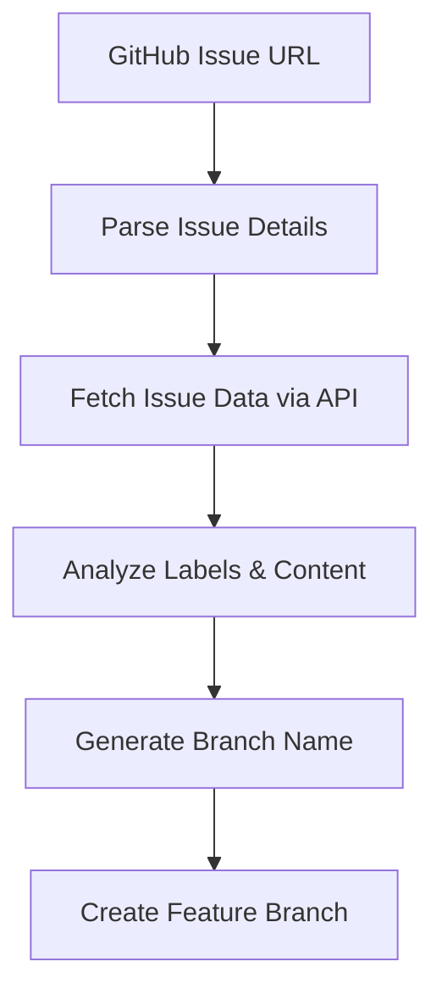
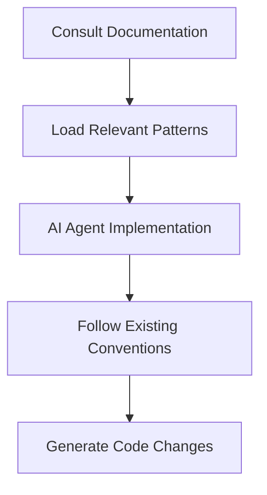
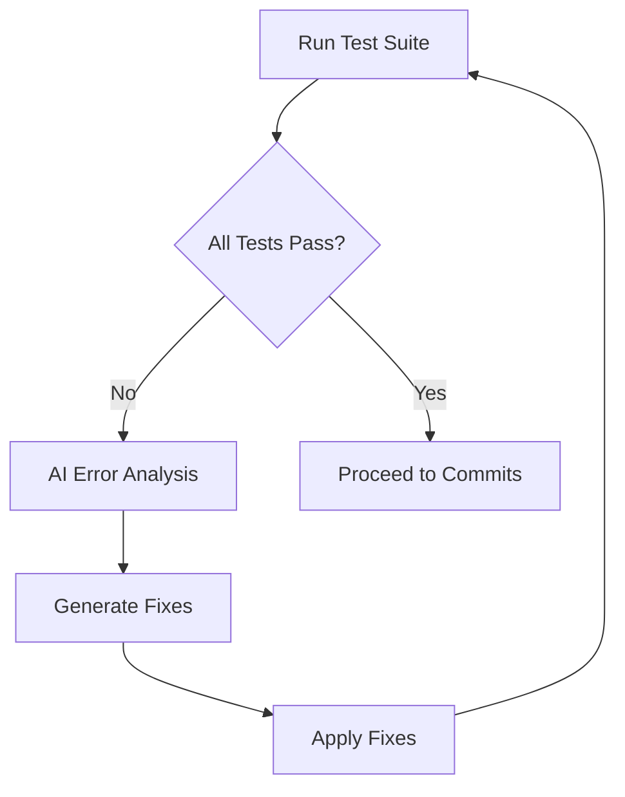
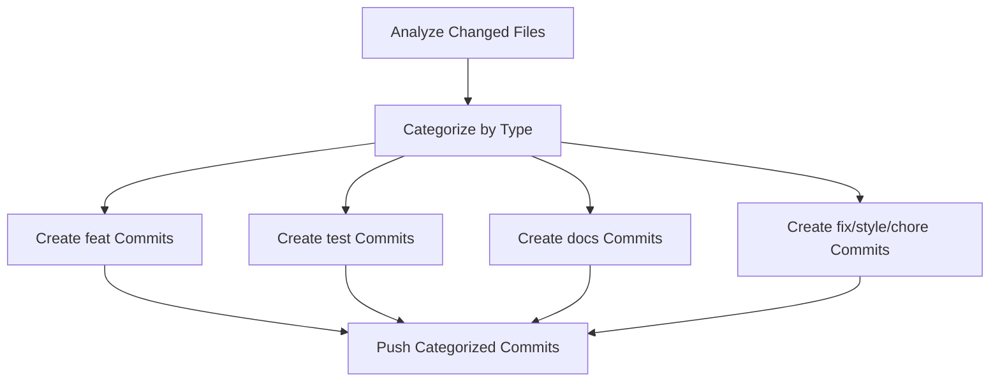

# 🤖 Implementation Workflow Documentation

## Overview
This document describes the automated implementation workflow that replaces the traditional `pnpm commit` approach with a comprehensive AI-driven development process.

## Workflow Architecture

### 1. Issue Analysis Phase


### 2. Implementation Phase


### 3. Quality Assurance Phase


### 4. Commit Generation Phase


## Technical Implementation

### Core Script Structure
```javascript
class IssueImplementationManager {
  // Main workflow orchestrator
  async run(issueUrl) {
    const issue = await this.fetchIssue(issueUrl);
    const branch = this.generateBranchName(issue);
    
    await this.createBranch(branch);
    await this.implementIssue(issue);
    await this.runTestSuite();
    await this.generateCategorizedCommits(issue, branch);
    await this.preparePRTemplate(issue, branch);
  }
}
```

### File Categorization Logic
```javascript
categorizeFiles(files) {
  const categories = {
    feat: [],      // Implementation files
    test: [],      // Test files (.test., .spec., __tests__)
    docs: [],      // Documentation (.md, docs/)
    style: [],     // Styling (.css, .scss, styles)
    chore: []      // Config files (.json, .yml, config)
  };
  // Categorization logic...
}
```

### Commit Message Generation
```javascript
generateCommitMessage(type, issue, branchName) {
  return `${type}(${branchName}): ${issue.title} (#${issue.number})`;
}
```

## Documentation Integration

### Automatic Reference System
The implementation agent automatically consults:

1. **Global Documentation** (`.github/docs/`)
   - `nest/` - Backend development patterns
   - `next/` - Frontend development guides  
   - `turbo/` - Monorepo configuration

2. **Project Documentation** (`apps/*/docs/`)
   - App-specific implementation guides
   - Architecture decisions
   - Best practices

3. **Package Documentation** (`packages/*/docs/`)
   - Component usage patterns
   - API documentation
   - Integration examples

### Documentation Structure
```
.github/docs/
├── nest/
│   ├── controllers.md
│   ├── services.md
│   ├── modules.md
│   └── testing.md
├── next/
│   ├── components.md
│   ├── routing.md
│   └── styling.md
└── turbo/
    ├── configuration.md
    └── optimization.md

apps/web/docs/
├── README.md           # Project overview
├── architecture.md     # System design
└── deployment.md       # Deployment guide

apps/api/docs/
├── README.md           # API overview
├── endpoints.md        # API documentation
└── authentication.md   # Auth implementation

packages/ui/docs/
├── README.md           # Component library
├── components.md       # Individual components
└── theming.md          # Design system
```

## Issue Template Updates

### New Template Features

#### English Titles
All issue titles should be in English for consistency and better AI processing.

#### Branch Name Suggestions
Each template includes suggested branch naming following the pattern:
```
<type>/<issue-number>-<topic>
```

#### Documentation References
Templates now include checkboxes for relevant documentation:
- [ ] Check `.github/docs/nest/` for backend patterns
- [ ] Check `.github/docs/next/` for frontend patterns
- [ ] Review existing component patterns

### Example Feature Request Template
```markdown
## 🌿 Branch Name
**Suggested Branch**: `feat/<issue-number>-<topic>`

## 📚 Documentation References
- [ ] Check `.github/docs/nest/` for backend patterns
- [ ] Check `.github/docs/next/` for frontend patterns
- [ ] Check `.github/docs/turbo/` for monorepo configuration
```

## Commit Strategy

### Categorized Commit Types

1. **feat** - New functionality implementation
   - Controllers, services, components
   - Business logic
   - API endpoints

2. **test** - Testing additions/modifications
   - Unit tests (`.test.ts`, `.spec.ts`)
   - E2E tests
   - Test utilities

3. **docs** - Documentation updates
   - README files
   - API documentation
   - Code comments

4. **style** - Visual/formatting changes
   - CSS/SCSS files
   - Styling components
   - Theme updates

5. **fix** - Bug corrections
   - Error handling
   - Edge case fixes
   - Performance improvements

6. **chore** - Maintenance tasks
   - Configuration files
   - Dependencies
   - Build scripts

### Commit Message Examples
```bash
feat(auth-api): implement JWT authentication service (#31)
test(auth-api): add authentication test coverage (#31)
docs(auth-api): update API authentication guide (#31)
style(auth-api): apply consistent button styling (#31)
fix(auth-api): resolve token refresh edge case (#31)
chore(auth-api): update authentication dependencies (#31)
```

## PR Template Integration

### Automated Template Filling
The workflow automatically fills the PR template with:

1. **Issue Reference**
   ```markdown
   Closes #42
   ```

2. **Implementation Summary**
   ```markdown
   ### O que foi alterado:
   - Implemented user authentication system
   - Added JWT token management
   - Created login/logout endpoints
   - Added authentication middleware
   ```

3. **Testing Information**
   ```markdown
   ### Testes Executados
   - [x] `pnpm test` - All unit tests passing
   - [x] `pnpm lint` - Code style validated
   - [x] `pnpm build` - Production build successful
   - [x] `pnpm check-types` - TypeScript compilation clean
   ```

## Error Handling & Recovery

### Test Failure Resolution
When tests fail, the system:

1. **Captures Error Context**
   - Error messages and stack traces
   - Failed test names and locations
   - Build output and warnings

2. **AI-Powered Analysis**
   - Identifies error patterns
   - Suggests specific fixes
   - References relevant documentation

3. **Automatic Fix Application**
   - Applies suggested solutions
   - Retries test execution
   - Continues until success or manual intervention needed

### Retry Logic
```javascript
async runTestSuite() {
  const maxRetries = 3;
  for (let attempt = 1; attempt <= maxRetries; attempt++) {
    try {
      await this.executeTests();
      return; // Success
    } catch (error) {
      if (attempt === maxRetries) throw error;
      await this.fixTestErrors(error);
    }
  }
}
```

## Benefits & Impact

### Developer Experience
- ✅ **Consistent Quality**: Automated testing ensures reliability
- ✅ **Faster Iteration**: Reduced manual overhead
- ✅ **Better Documentation**: Automatic consultation of guides
- ✅ **Standardized Process**: Consistent workflow across team
- ✅ **Reduced Errors**: AI-powered error detection and fixing

### Project Management
- ✅ **Traceability**: Clear issue → commits → PR chain
- ✅ **Quality Gates**: All changes pass comprehensive testing
- ✅ **Documentation Compliance**: Automatic reference to standards
- ✅ **Audit Trail**: Detailed commit categorization
- ✅ **Predictable Delivery**: Standardized implementation workflow

## Migration from Previous System

### Removed Components
- **Commitizen**: No longer needed for interactive commits
- **Manual Commit Prompts**: Replaced by automated generation
- **pnpm commit script**: Removed from package.json

### Preserved Components
- **Commitlint**: Still validates commit message format
- **Changesets**: Continues to manage package versioning
- **GitHub Actions**: Existing CI/CD workflows unchanged

### New Requirements
- **GitHub Token**: Required for API access
- **Issue Templates**: Updated with new format
- **Documentation Structure**: Centralized docs in each project
- **Node.js Environment**: Required for implementation script

## Future Enhancements

### Planned Features
1. **Smart Branch Suggestions**: AI-powered branch name optimization
2. **Dependency Analysis**: Automatic package updates during implementation
3. **Performance Monitoring**: Implementation impact tracking
4. **Code Review Automation**: AI-powered code quality analysis
5. **Integration Testing**: Cross-package compatibility verification

### Extensibility Points
- Custom file categorization rules
- Additional test suite integration
- Enhanced error recovery strategies
- Project-specific implementation patterns
