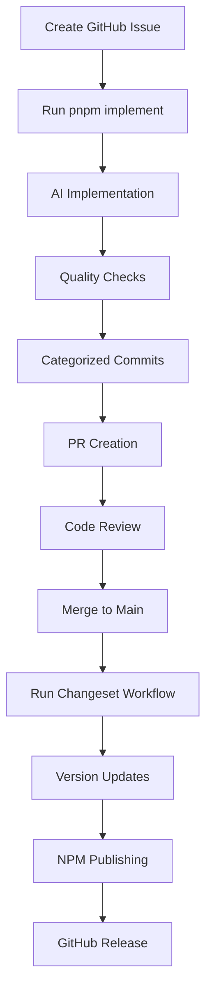

# 🎉 Automated Changeset & NPM Publishing - Implementation Summary

## ✅ Completed Features

### 1. 📦 **New Package: @arthurcorreadev/components-core**
- **✅ Created**: Core React components library with TypeScript
- **✅ Configured**: Full build pipeline with Tsup
- **✅ Documented**: Comprehensive documentation in `/docs` folder
- **✅ Components**: Button, Card, Input, Modal, Toast with hooks
- **✅ Utilities**: Type-safe styling with class-variance-authority
- **✅ Scope**: Published under `@arthurcorreadev` NPM scope

### 2. 🤖 **Automated Changeset Workflow**
- **✅ Script**: `.github/scripts/changeset-publish.js`
- **✅ Commands**:
  ```bash
  pnpm changeset:release     # Interactive workflow
  pnpm changeset:auto        # Automatic changeset generation
  pnpm release:dry-run       # Test without publishing
  ```
- **✅ Features**:
  - Automatic commit analysis for version determination
  - Quality checks before publishing (lint, test, build)
  - NPM publishing with authentication
  - GitHub release creation with changelogs
  - Error handling and recovery

### 3. 🔄 **GitHub Actions Integration**
- **✅ Workflow**: `.github/workflows/release-publish.yml`
- **✅ Triggers**: 
  - Push to main branch
  - Manual workflow dispatch
- **✅ Features**:
  - Automatic changeset detection
  - Quality gate validation
  - NPM package publishing
  - GitHub release creation
  - Failure notifications

### 4. 📚 **Centralized Documentation**
- **✅ Turborepo Docs**: `/docs` folder with comprehensive guides
- **✅ Package Docs**: Individual `/docs` folders for each package
- **✅ Workflow Docs**: Complete changeset and publishing guides
- **✅ API Docs**: Component documentation with examples

### 5. 🔐 **Environment Configuration**
- **✅ Template**: `.env.example` with all required variables
- **✅ Local**: `.env.local` for development
- **✅ Required Variables**:
  ```env
  GITHUB_TOKEN=your_github_token
  NPM_TOKEN=your_npm_token  
  NPM_SCOPE=@arthurcorreadev
  GITHUB_REPOSITORY=ArthurProjectCorrea/template-project
  ```

### 6. 🔄 **Enhanced Implementation Workflow**
- **✅ Integration**: Changeset prompts added to implementation script
- **✅ Reminders**: Automatic changeset reminder files
- **✅ Guidance**: Step-by-step instructions for release process

## 🚀 **Complete Workflow Overview**

### Implementation → Release Pipeline


### Commands Reference
```bash
# Development Workflow
pnpm implement <github-issue-url>  # Implement issue automatically

# Release Workflow (after merge)
pnpm changeset:auto               # Full automated release
pnpm changeset:release            # Interactive release
pnpm release:dry-run             # Test release process

# Manual Package Management
pnpm changeset                   # Create changeset manually
pnpm version-packages            # Update versions
pnpm release                     # Publish packages
```

## 📊 **Quality Assurance Integration**

### Automated Checks
- **🔍 Linting**: ESLint validation across all packages
- **📝 Type Checking**: TypeScript compilation verification
- **🧪 Testing**: Unit and E2E test execution
- **🏗️ Building**: Production build verification
- **📦 Package Validation**: Bundle analysis and size checks

### Publishing Gates
- ✅ All quality checks must pass
- ✅ Semantic versioning compliance
- ✅ Changelog generation
- ✅ Package integrity verification
- ✅ NPM authentication validation

## 🎯 **Package Publishing Features**

### @arthurcorreadev/components-core
- **Automatic Versioning**: Based on conventional commits
- **TypeScript Support**: Full type definitions
- **ESM/CJS Support**: Dual package format
- **Tree Shaking**: Optimized bundle structure
- **React 18+**: Modern React patterns

### Publishing Strategy
- **Patch**: Bug fixes, documentation updates
- **Minor**: New components, backwards compatible features
- **Major**: Breaking changes, API modifications

## 🔧 **Technical Architecture**

### File Structure
```
template-project/
├── .github/
│   ├── scripts/
│   │   ├── implement-issue.js      # Implementation automation
│   │   └── changeset-publish.js    # Release automation
│   └── workflows/
│       └── release-publish.yml     # GitHub Actions
├── docs/                           # Turborepo documentation
├── packages/
│   └── components-core/            # New NPM package
│       ├── src/                    # Component source
│       ├── docs/                   # Package documentation
│       └── package.json            # Package configuration
├── .env.example                    # Environment template
└── .env.local                      # Local environment
```

### Integration Points
- **Turborepo**: Monorepo build orchestration
- **Changesets**: Version management and changelogs
- **GitHub Actions**: CI/CD automation
- **NPM Registry**: Package distribution
- **GitHub Releases**: Release management

## 🎉 **Benefits Achieved**

### For Developers
- ✅ **Streamlined Workflow**: Single command from issue to release
- ✅ **Quality Assurance**: Automated testing and validation
- ✅ **Documentation**: Comprehensive guides and examples
- ✅ **Consistency**: Standardized process across team

### For Project Management
- ✅ **Traceability**: Complete audit trail from issue to release
- ✅ **Automation**: Reduced manual overhead
- ✅ **Quality Control**: Multiple validation checkpoints
- ✅ **Release Notes**: Automatic changelog generation

### For Package Consumers
- ✅ **Reliable Releases**: Quality-tested packages
- ✅ **Clear Documentation**: Comprehensive usage guides
- ✅ **Semantic Versioning**: Predictable version changes
- ✅ **TypeScript Support**: Full type safety

## 🔮 **Next Steps**

### Setup Requirements
1. **Configure NPM Token**: Set up `NPM_TOKEN` environment variable
2. **GitHub Permissions**: Ensure token has repo and package permissions  
3. **Team Training**: Familiarize team with new workflow
4. **Package Registry**: Verify `@arthurcorreadev` scope availability

### Usage Examples
```bash
# Example implementation workflow
pnpm implement https://github.com/ArthurProjectCorrea/template-project/issues/1

# Example release workflow  
pnpm changeset:auto

# Example component usage
npm install @arthurcorreadev/components-core
```

## 📞 **Support & Documentation**

### Key Resources
- **Workflow Guide**: `.github/docs/IMPLEMENTATION_WORKFLOW.md`
- **Publishing Guide**: `docs/package-publishing.md`
- **Component Docs**: `packages/components-core/README.md`
- **Environment Setup**: `.env.example`

### Getting Help
- Create issues with appropriate labels
- Reference documentation for troubleshooting
- Check GitHub Actions logs for CI/CD issues
- Verify environment variable configuration

---

## 🎊 **Ready for Production!**

Your template project now includes a complete automated workflow for:
- 🤖 **Issue Implementation** with AI assistance
- 📦 **Package Management** with semantic versioning
- 🚀 **NPM Publishing** with quality gates
- 📝 **Release Management** with automated changelogs
- 🔄 **CI/CD Integration** with GitHub Actions

**Happy shipping!** 🚀✨
